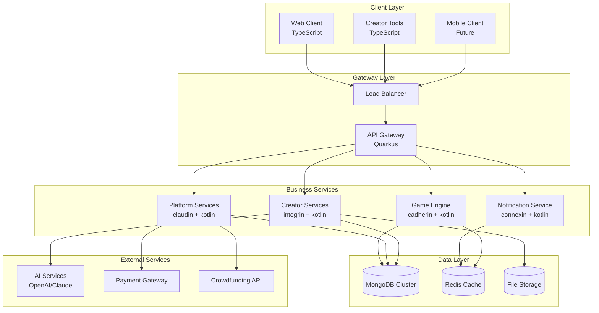

# Junction 技術架構設計

## 整體架構原則

### 微服務架構
- **服務分離**: 按業務領域劃分服務邊界
- **獨立部署**: 各服務可獨立開發、測試、部署
- **技術多樣性**: 允許不同服務使用最適合的技術棧
- **容錯設計**: 服務間故障隔離

### 細胞生物學命名規範
基於 cell junction 概念的組件命名：

| 組件 | 生物學對應 | 功能 |
|------|------------|------|
| `cadherin` | 鈣黏蛋白 | DSL 解釋器，連接創作與執行 |
| `claudin` | 緊密連接蛋白 | 安全與權限管理 |
| `integrin` | 整合素 | 外部系統整合介面 |
| `connexin` | 連接蛋白 | 即時通訊系統 |
| `desmosome` | 胞間連接 | 持久化資料連接 |
| `cytoplasm` | 細胞質 | 共享資料層 |

## 服務架構圖



## 核心服務詳細設計

### 1. Game Engine Service (cadherin)

**職責**:
- DSL 解釋與執行
- 遊戲狀態管理
- 規則引擎執行
- 多人同步協調

**技術棧**:
- Kotlin + Quarkus
- MongoDB (遊戲狀態)
- Redis (即時狀態快取)
- WebSocket (即時通訊)

**核心組件**:
```
cadherin/
├── dsl/
│   ├── parser/          # DSL 語法解析
│   ├── validator/       # 規則驗證
│   └── interpreter/     # 執行引擎
├── game/
│   ├── engine/          # 遊戲引擎核心
│   ├── state/           # 狀態管理
│   └── sync/            # 多人同步
└── rules/
    ├── card/            # 卡牌規則
    ├── turn/            # 回合管理
    └── win/             # 勝負判定
```

### 2. Platform Services (claudin)

**職責**:
- 使用者認證與授權
- 遊戲房間管理
- 社群功能 (評價、分享)
- 群眾募資與支付

**技術棧**:
- Kotlin + Quarkus
- MongoDB (使用者資料)
- JWT 認證
- OAuth2 整合

### 3. Creator Services (integrin)

**職責**:
- 遊戲創作工具後端
- AI 輔助創作
- 素材管理
- 版本控制

**技術棧**:
- Kotlin + Quarkus
- MongoDB (專案資料)
- S3 相容儲存 (素材檔案)
- OpenAI/Claude API

### 4. Notification Service (connexin)

**職責**:
- 即時通訊
- 推播通知
- 遊戲事件廣播
- 系統狀態監控

**技術棧**:
- Kotlin + Quarkus
- Redis (訊息佇列)
- WebSocket
- Server-Sent Events

## 資料架構設計

### MongoDB 集合設計

#### Users Collection
```json
{
  "_id": "ObjectId",
  "username": "string",
  "email": "string",
  "profile": {
    "displayName": "string",
    "avatar": "string",
    "bio": "string"
  },
  "auth": {
    "passwordHash": "string",
    "providers": ["local", "google", "github"]
  },
  "credits": {
    "balance": "number",
    "donated": "number",
    "received": "number"
  },
  "created": "timestamp",
  "lastActive": "timestamp"
}
```

#### Games Collection
```json
{
  "_id": "ObjectId",
  "title": "string",
  "description": "string",
  "author": "ObjectId(users)",
  "dsl": {
    "version": "string",
    "content": "string",
    "compiled": "object"
  },
  "assets": {
    "cards": ["object"],
    "images": ["string"],
    "sounds": ["string"]
  },
  "metadata": {
    "tags": ["string"],
    "category": "string",
    "difficulty": "string",
    "playerCount": {"min": "number", "max": "number"},
    "duration": "number"
  },
  "stats": {
    "plays": "number",
    "rating": "number",
    "reviews": "number"
  },
  "visibility": "enum[public, private, unlisted]",
  "created": "timestamp",
  "updated": "timestamp"
}
```

#### GameSessions Collection
```json
{
  "_id": "ObjectId",
  "gameId": "ObjectId(games)",
  "players": [{
    "userId": "ObjectId(users)",
    "joinedAt": "timestamp",
    "status": "enum[waiting, playing, finished, disconnected]"
  }],
  "state": {
    "phase": "string",
    "turn": "number",
    "currentPlayer": "number",
    "gameData": "object"
  },
  "events": [{
    "type": "string",
    "playerId": "ObjectId(users)",
    "data": "object",
    "timestamp": "timestamp"
  }],
  "config": {
    "maxPlayers": "number",
    "isPrivate": "boolean",
    "allowSpectators": "boolean"
  },
  "created": "timestamp",
  "finished": "timestamp"
}
```

## 安全性設計

### 認證與授權
- JWT Token 認證
- Role-based Access Control (RBAC)
- API Rate Limiting
- CORS 配置

### 資料保護
- 密碼 bcrypt 雜湊
- 敏感資料加密
- PII 資料遮罩
- GDPR 合規

### 網路安全
- HTTPS 強制
- CSP Headers
- SQL Injection 防護
- XSS 防護

## 效能優化策略

### 快取策略
- Redis 快取熱門遊戲資料
- CDN 快取靜態資源
- 應用層快取 DSL 編譯結果
- 資料庫查詢結果快取

### 資料庫優化
- 適當的索引設計
- 查詢效能監控
- 連接池配置
- 讀寫分離

### 網路優化
- gzip 壓縮
- 資源檔案最小化
- 圖片最佳化
- WebSocket 連接復用

## 監控與營運

### 應用監控
- 效能指標 (回應時間、吞吐量)
- 錯誤率監控
- 自定義業務指標
- 告警機制

### 基礎設施監控
- 伺服器資源使用率
- 資料庫效能指標
- 網路流量監控
- 容器健康檢查

### 日誌管理
- 結構化日誌
- 集中式日誌收集
- 日誌分析與搜尋
- 審計日誌

## 部署策略

### 容器化
- Docker 容器打包
- Kubernetes 編排
- 微服務獨立部署
- 藍綠部署

### CI/CD 流程
- Git 版本控制
- 自動化測試
- 程式碼品質檢查
- 自動部署管道

### 環境管理
- 開發、測試、生產環境分離
- 配置檔案管理
- 秘密金鑰管理
- 環境變數配置