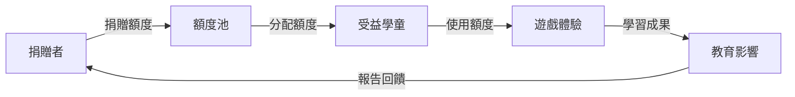

# Community Features 開發計劃

## 目標

建立健康活躍的遊戲社群生態，包含評價系統、群眾募資、待用額度等社會影響功能。

## 核心組件

### 1. 評價與推薦系統
- 遊戲評分機制
- 詳細評論功能
- 推薦演算法
- 內容品質控制

### 2. 群眾募資平台
- 專案募資發起
- 資金管理與分配
- 里程碑追蹤
- 回饋者權益保護

### 3. 待用額度系統
- 額度捐贈機制
- 受益者申請流程
- 透明度追蹤
- 社會影響報告

### 4. 社群互動功能
- 創作者追蹤
- 遊戲收藏與分享
- 討論區與論壇
- 活動與競賽

## 開發里程碑

### Phase 4.1: 評價系統 (週 1-2)
- [ ] 五星評分機制
- [ ] 結構化評論系統
- [ ] 評論品質評估
- [ ] 惡意評論防護

### Phase 4.2: 推薦演算法 (週 3-4)
- [ ] 協同過濾推薦
- [ ] 內容特徵分析
- [ ] 個人化推薦
- [ ] 推薦效果追蹤

### Phase 4.3: 群眾募資功能 (週 5-7)
- [ ] 募資專案建立
- [ ] 支付系統整合
- [ ] 資金託管機制
- [ ] 進度追蹤功能

### Phase 4.4: 待用額度系統 (週 8-9)
- [ ] 捐贈流程設計
- [ ] 受益者認證機制
- [ ] 額度分配演算法
- [ ] 使用追蹤與報告

### Phase 4.5: 社群互動功能 (週 10-11)
- [ ] 使用者追蹤系統
- [ ] 收藏與分享功能
- [ ] 討論區架構
- [ ] 活動管理系統

### Phase 4.6: 營運與監控 (週 12)
- [ ] 社群健康指標
- [ ] 內容審核機制
- [ ] 使用者行為分析
- [ ] 自動化營運工具

## 社會影響設計

### 待用額度機制

### 透明度保證
- 資金流向公開透明
- 使用情況定期報告
- 第三方監督機制
- 區塊鏈技術應用考量

## 推薦系統設計

### 推薦策略
1. **協同過濾**: 基於相似使用者喜好
2. **內容過濾**: 基於遊戲特徵相似性
3. **知識圖譜**: 基於教育領域關聯
4. **混合推薦**: 結合多種策略

### 個人化因素
- 使用者年齡與教育背景
- 遊戲偏好歷史
- 學習進度與成就
- 社交網路影響

## 群眾募資模式

### 募資類型
- **遊戲開發**: 支持新遊戲創作
- **平台維護**: 支持平台持續營運
- **公益專案**: 支持弱勢教育專案
- **技術研發**: 支持新功能開發

### 風險控制
- 專案審核機制
- 資金分階段釋放
- 里程碑達成驗證
- 失敗專案退款保護

## 內容審核機制

### 自動化審核
- 內容關鍵字過濾
- 圖片內容識別
- 垃圾內容檢測
- 重複內容識別

### 人工審核
- 社群檢舉處理
- 專家內容評估
- 教育適宜性審核
- 版權問題處理

### 社群自治
- 使用者評分系統
- 社群版主機制
- 同儕審核制度
- 聲譽積分系統