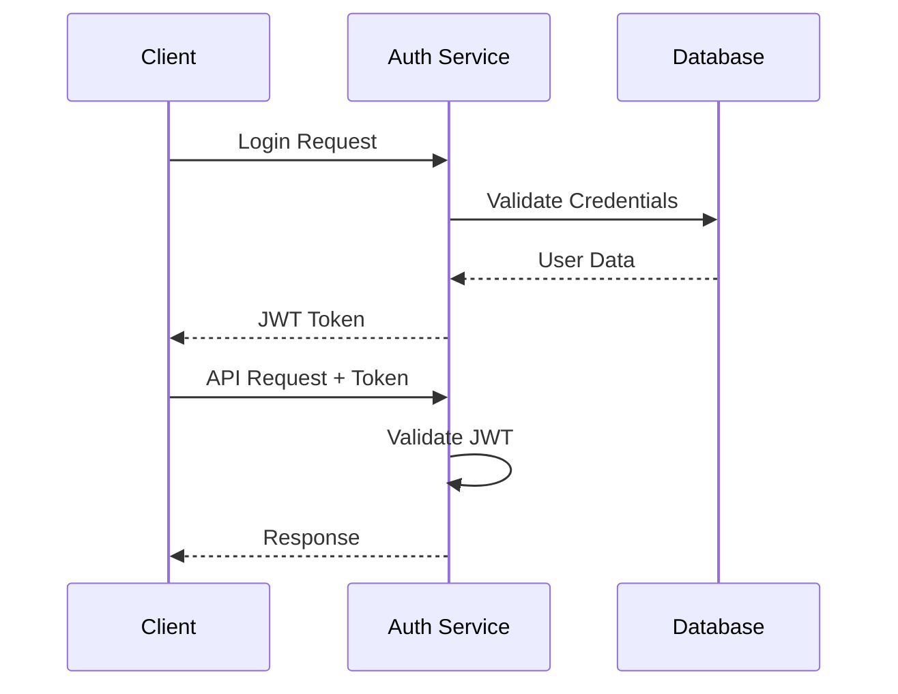

# Platform Services 開發計劃

## 目標

建立 Junction 平台的基礎設施服務，包含使用者管理、認證授權、遊戲房間管理等核心功能。

## 核心組件

### 1. 使用者管理系統 (claudin-auth)
- 使用者註冊與認證
- OAuth2 第三方登入整合
- 使用者檔案管理
- 權限角色管理

### 2. 遊戲房間管理 (claudin-rooms)
- 遊戲房間建立與管理
- 玩家配對系統
- 房間狀態監控
- 觀眾模式支援

### 3. 社群功能 (claudin-social)
- 評價與評論系統
- 好友與追蹤功能
- 遊戲分享機制
- 社群活動追蹤

### 4. 支付與募資 (claudin-payment)
- 群眾募資整合
- 待用額度系統
- 支付處理
- 交易記錄管理

## 開發里程碑

### Phase 2.1: 使用者認證系統 (週 1-2)
- [ ] JWT 認證機制
- [ ] 使用者註冊流程
- [ ] OAuth2 整合 (Google, GitHub)
- [ ] 密碼安全處理

### Phase 2.2: 使用者檔案管理 (週 3-4)
- [ ] 使用者資料模型
- [ ] 檔案上傳與管理
- [ ] 隱私設定控制
- [ ] 帳號停用/刪除

### Phase 2.3: 遊戲房間系統 (週 5-6)
- [ ] 房間建立與設定
- [ ] 玩家邀請機制
- [ ] 自動配對系統
- [ ] 房間狀態管理

### Phase 2.4: 社群基礎功能 (週 7-8)
- [ ] 評價系統設計
- [ ] 評論與回覆功能
- [ ] 使用者互動 API
- [ ] 內容舉報機制

## 技術規格

### 認證流程

### 資料模型設計
- Users Collection
- UserSessions Collection  
- GameRooms Collection
- Reviews Collection
- Transactions Collection

## 安全考量

### 認證安全
- bcrypt 密碼雜湊
- JWT Token 過期機制
- Refresh Token 輪換
- 多因素認證支援

### 資料保護
- 個人資料加密
- GDPR 合規處理
- 資料存取日誌
- 敏感資料遮罩

### API 安全
- Rate Limiting
- CORS 設定
- Input Validation
- SQL Injection 防護